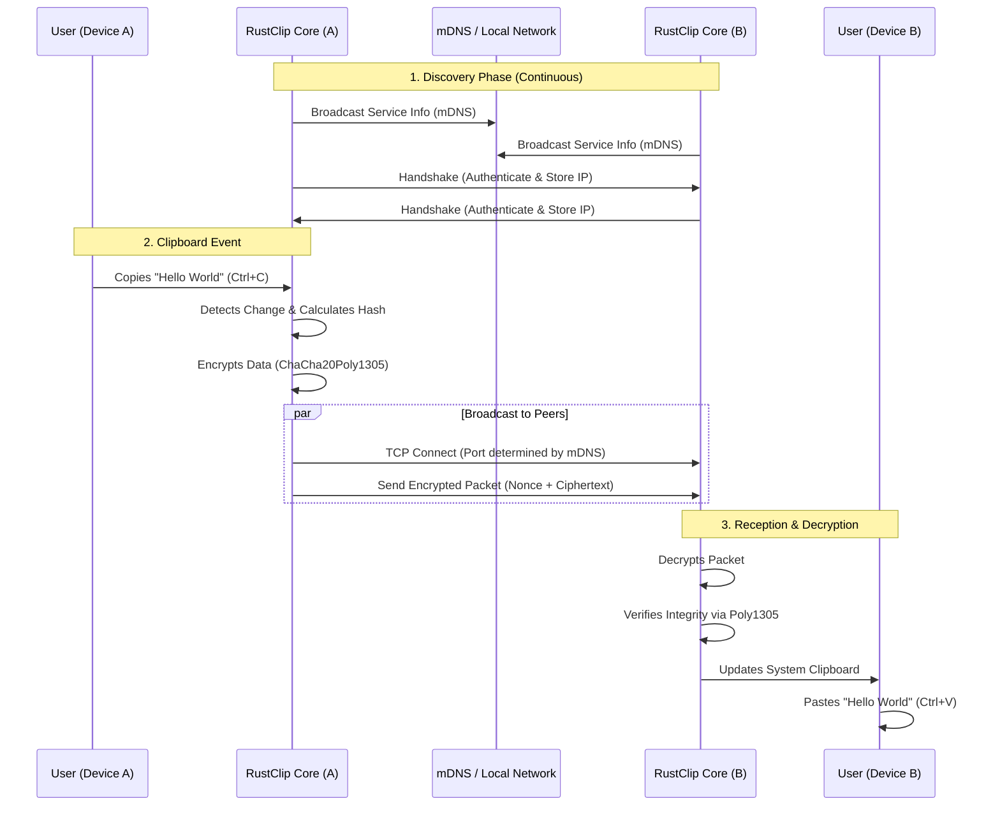

# RustClip 🦀

**RustClip** is a lightweight, secure, and fast clipboard synchronization tool written in Rust. It allows you to seamlessly copy text or images on one device and paste them on another within the same local network (LAN), prioritizing speed and privacy.

---

## 🏗 System Architecture & Workflow

RustClip operates on a **peer-to-peer (P2P)** architecture over the local network. It does not rely on any central cloud server, ensuring your data never leaves your infrastructure.

### 🔄 Data Flow Diagram



---

## 🔐 Security & Authentication

RustClip takes security seriously. It employs a **"Ring"** trust model where only devices sharing the same cryptographic secret can communicate.

### 1. The Ring Identity (Authentication)
*   **Mnemonic Phrase**: When you initialize RustClip, it generates a BIP39 mnemonic phrase (e.g., `apple river house...`). This phrase is the "master key" to your Ring.
*   **Derivation**: Using `HKDF` (HMAC-based Key Derivation Function) with SHA-256, the mnemonic is used to purely derive:
    *   **Service Name**: A hash used to obscure the mDNS service name (prevents outsiders from even seeing your clipboard group in discovery).
    *   **Encryption Key**: A 32-byte key used for `ChaCha20Poly1305` symmetric encryption.
*   **Zero-Knowledge Discovery**: Devices discover each other using the derived Service Name. If a device has a different mnemonic, it will derive a different service name and simply won't see your devices.

### 2. End-to-End Encryption (Data Transmission)
*   **Algorithm**: `ChaCha20Poly1305` (IETF variant).
*   **Process**:
    1.  **Nonce Generation**: For every clipboard packet sent, a unique 96-bit random Nonce is generated.
    2.  **Encryption**: The clipboard content (Text or Image bytes) is encrypted using the shared Key and the Nonce.
    3.  **Transport**: The packet sent over TCP is `[Nonce (12 bytes) | Ciphertext (N bytes) | Tag (16 bytes, included in ciphertext)]`.
    4.  **Decryption**: Validates the tag (integrity check) and decrypts. If the key doesn't match, decryption fails, and the packet is discarded.

---

## ⚙️ Core Components

### 1. Clipboard Monitor
The core logic runs a loop that polls the system clipboard for changes.
*   **State Management**: It maintains a `recent_hashes` cache to prevent "echo loops" (e.g., A sends to B, B updates, B detects change, B sends back to A).
*   **Optimizations**: Text is sent instantly. Images are compressed (PNG) to reduce bandwidth but may take slightly longer.

### 2. Discovery Module (mDNS)
Uses Multicast DNS to find peers on the local network automatically.
*   **Port**: Dynamically assigned (usually starts at 55000+).
*   **Refresh**: Dynamically adds and removes peers as they come online or go offline.

### 3. Settings & Persistence
*   **Configuration**: Saved in standard OS-specific data directories (e.g., `~/Library/Application Support/com.rustclip.rust-clip/` on macOS).
*   **Identity**: Your private key is stored encrypted on disk (`identity.enc`), protected by a locally generated key.

---

## 🖥 User Interface (GUI)

The GUI is built with **egui** and **eframe**, providing a lightweight, native-feeling interface.

*   **Dashboard**: Shows active status, connected peers, and recent event logs.
*   **Settings**:
    *   **Language Selection**: Switch between English and Italian.
    *   **Credentials**: View/Copy your secret mnemonic to add new devices.
    *   **Danger Zone**: Reset your identity (generates a new Ring, disconnecting you from old peers).
*   **System Tray**:
    *   Runs in the background.
    *   **Left Click**: Opens/Restores the Dashboard (Mac/Windows).
    *   **Right Click / Menu**: Options to Open or Quit.

## 💻 Command Line Interface (CLI)

RustClip can also be run in "headless" mode for servers or advanced users.

*   `rust-clip start`: Runs the daemon in the foreground without GUI.
*   `rust-clip new`: Generates a new identity configuration.
*   `rust-clip join`: Prompts for a mnemonic phrase to join an existing Ring.

---

## 🛠️ Build & Installation

Ready-to-use executables for Windows, macOS, and Linux are generally available in the **GitHub Releases** section.

If you prefer to build from source, follow these steps:

### Prerequisites
*   **Rust**: Install the latest stable version via [rustup.rs](https://rustup.rs/).
*   **Git**: To clone the repository.

### 🍎 Building for macOS
1.  Ensure you have Xcode Command Line Tools installed (`xcode-select --install`).
2.  Clone and build:
    ```bash
    git clone https://github.com/fedepaj/rust-clip.git
    cd rust-clip
    cargo build --release
    ```
3.  The binary will be at `target/release/rust-clip`.
4.  *(Optional)* Create an App Bundle structure `RustClip.app` manually or use tools like `cargo-bundle` if distributing.

### 🐧 Building for Linux
1.  Install system dependencies (varies by distro). For generic Debian/Ubuntu:
    ```bash
    sudo apt install libxcb-shape0-dev libxcb-xfixes0-dev # for clipboard support
    ```
2.  Build:
    ```bash
    cargo build --release
    ```
3.  The binary is at `target/release/rust-clip`. You can move it to `/usr/local/bin` or run it directly.

### 🪟 Building for Windows & Installer
1.  **Build Binary**:
    ```powershell
    cargo build --release
    ```
    This produces `target/release/rust-clip.exe`.
2.  **Create Installer (Inno Setup)**:
    *   We use **Inno Setup** to create a professional `.exe` installer.
    *   Install [Inno Setup](https://jrsoftware.org/isinfo.php).
    *   Open the `installer.iss` file located in the project root with Inno Setup Compiler.
    *   Click **Compile**.
    *   The final setup file (e.g., `mysetup.exe`) will be generated in the `Output` folder (or as configured in `.iss`).

---

## 🚀 Getting Started

1.  **Installation**: Download the binary or compile with `cargo build --release`.
2.  **First Run**: The app will generate a new Ring Identity.
3.  **Adding a Device**:
    *   Go to **Settings** > **Credentials** > **Show** Secret Key.
    *   Copy the phrase.
    *   On the second device, click **"Join another Ring"** (or use CLI `rust-clip join`) and paste the phrase.
4.  **Sync**: Copy text on Device A -> It appears on Device B.

---

## 📝 Troubleshooting

*   **Firewall**: Ensure RustClip is allowed through your local firewall (TCP ports are dynamic). 
    *   *Windows*: A prompt usually appears on first run.
    *   *macOS*: Ensure "Incoming Connections" are allowed if prompted.
*   **Discovery Issues**: If devices don't see each other:
    *   Ensure they are on the **exact same subnet**.
    *   Verify both are using the **exact same mnemonic phrase**.
    *   Check if the status circle is 🟢 ACTIVE.
